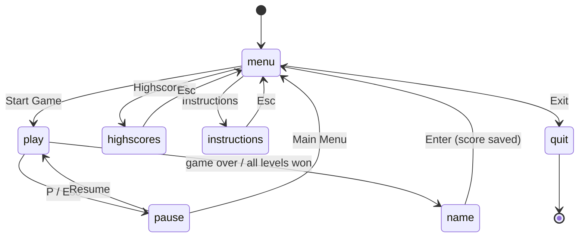
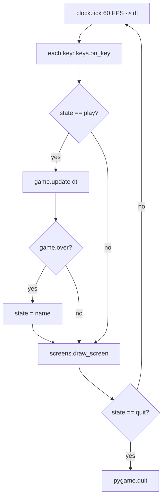
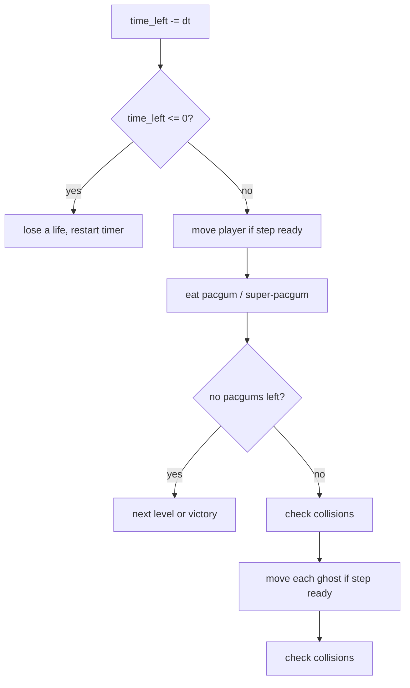
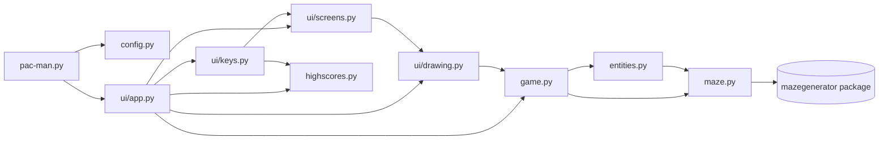
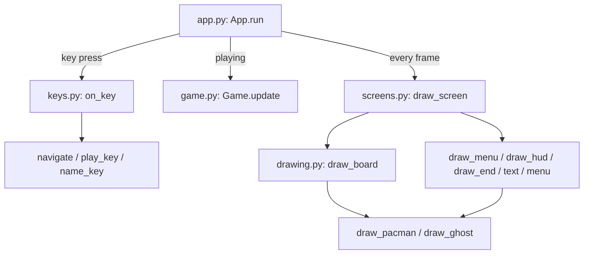
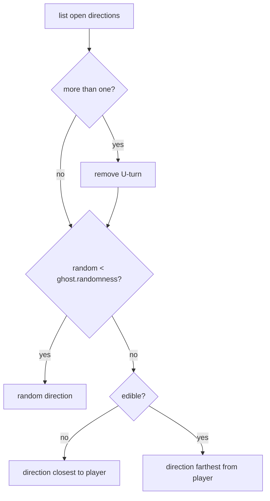

# Diagrams

## 1. Screens (`App.state`, changed by the keys in `ui/keys.py`)

## 2. Game loop (`App.run`)

## 3. `Game.update(dt)`

## 4. Modules

## 5. UI files: who calls what each frame

## 6. Ghost AI (`Ghost.choose_direction`)

